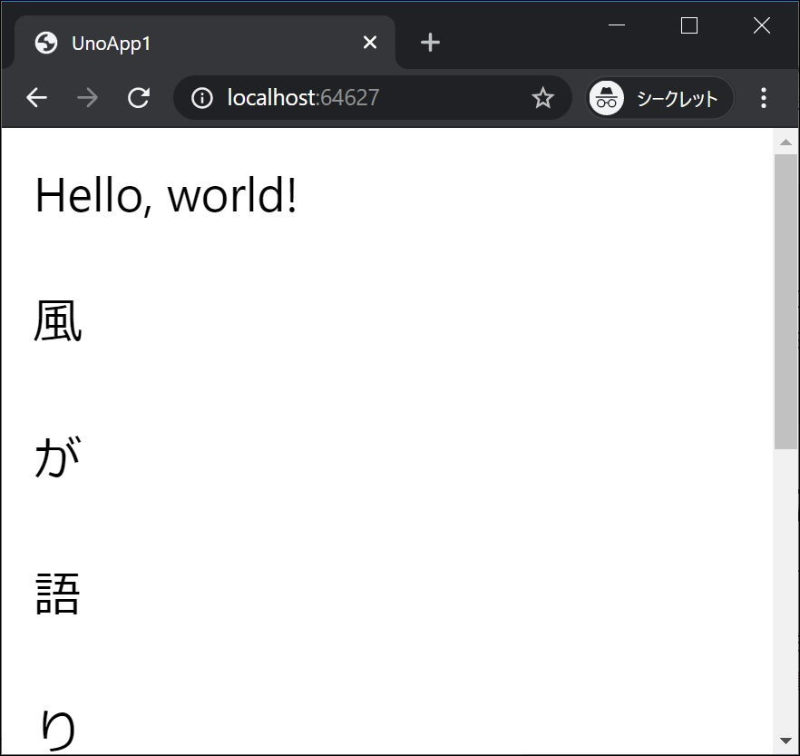
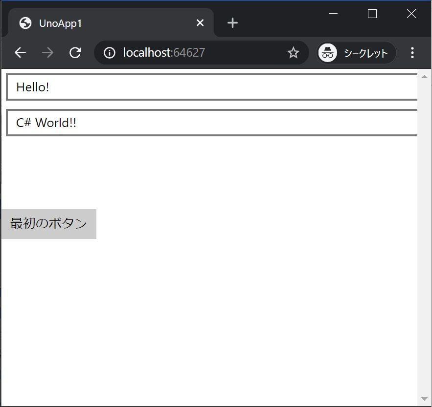
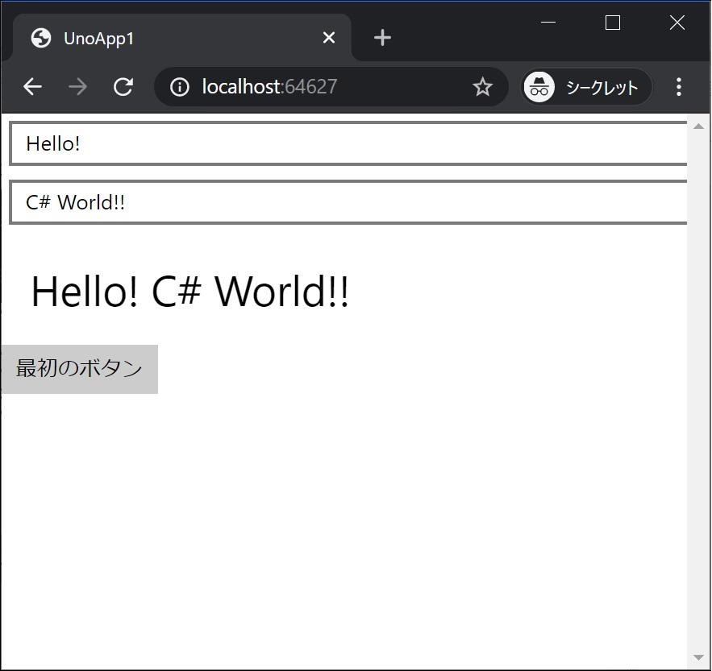

[Top](./top.md)  

# イベント処理と画面更新

コードを変更し、動きのあるアプリにして行きます。

# 画面に要素を追加

## ScrollViewer を画面全体に表示

まず、画面全体に表示する ScrollViewer と StackPanel を追加します。  

**MainPage.xaml** を開いて編集します。  

#### 編集前
```xml
<Page
    x:Class="UnoApp1.MainPage"
    xmlns="http://schemas.microsoft.com/winfx/2006/xaml/presentation"
    xmlns:x="http://schemas.microsoft.com/winfx/2006/xaml"
    xmlns:local="using:UnoApp1"
    xmlns:d="http://schemas.microsoft.com/expression/blend/2008"
    xmlns:mc="http://schemas.openxmlformats.org/markup-compatibility/2006"
    mc:Ignorable="d">

    <Grid Background="{ThemeResource ApplicationPageBackgroundThemeBrush}">
        <TextBlock Text="Hello, world!" Margin="20" FontSize="30" />
    </Grid>
</Page>
```

#### 編集後

```xml
<Page
    x:Class="UnoApp1.MainPage"
    xmlns="http://schemas.microsoft.com/winfx/2006/xaml/presentation"
    xmlns:x="http://schemas.microsoft.com/winfx/2006/xaml"
    xmlns:local="using:UnoApp1"
    xmlns:d="http://schemas.microsoft.com/expression/blend/2008"
    xmlns:mc="http://schemas.openxmlformats.org/markup-compatibility/2006"
    mc:Ignorable="d">

  <Grid Background="{ThemeResource ApplicationPageBackgroundThemeBrush}">
    <ScrollViewer>
      <StackPanel>
        <TextBlock Text="Hello, world!" Margin="20" FontSize="30" />
      </StackPanel>
    </ScrollViewer>
  </Grid>
</Page>
```

**ScrollViewer** は表示が画面からはみ出るとスクロールできるようになります。  
**StackPanel** はその子供の要素を一列に並べます。  

挙動を確認するために、**TextBox** をたくさん増やしてみます。
```xml
  <Grid Background="{ThemeResource ApplicationPageBackgroundThemeBrush}">
    <ScrollViewer>
      <StackPanel>
        <TextBlock Text="Hello, world!" Margin="20" FontSize="30" />
        <TextBlock Text="風" Margin="20" FontSize="30" />
        <TextBlock Text="が" Margin="20" FontSize="30" />
        <TextBlock Text="語" Margin="20" FontSize="30" />
        <TextBlock Text="り" Margin="20" FontSize="30" />
        <TextBlock Text="か" Margin="20" FontSize="30" />
        <TextBlock Text="け" Margin="20" FontSize="30" />
        <TextBlock Text="ま" Margin="20" FontSize="30" />
        <TextBlock Text="す" Margin="20" FontSize="30" />
      </StackPanel>
    </ScrollViewer>
  </Grid>
```
## 実行結果




スクロールできるようになっています。

## Button を置いてクリック時の処理を作る
ボタンクリック時の動きを作るコードの書き方は複数ありますが、まずはコード量の少ない方法から始めます。  

今回は **TextBox** を 2 つと **TextBlock** 1 つ、 **Button** 1 つを画面に追加し、ボタンのクリックで **TextBox** の文字列をつなげて **TextBlock** に表示するようにします。  
いったん、画面の **TextBlock** を全て削除し、4 つの要素を追加します。
```xml
      <StackPanel>
        <TextBox x:Name="textBox1" Text="Hello! " Margin="5" />
        <TextBox x:Name="textBox2" Text="C# World!!" Margin="5" />
        <TextBlock x:Name="textBlock1" Margin="20" FontSize="30" />
        <Button Content="最初のボタン" Click="Button1_Click"/>
      </StackPanel>
```

**MainPage.xaml** 全体は次のようになります。

```xml
<Page
    x:Class="UnoApp1.MainPage"
    xmlns="http://schemas.microsoft.com/winfx/2006/xaml/presentation"
    xmlns:x="http://schemas.microsoft.com/winfx/2006/xaml"
    xmlns:local="using:UnoApp1"
    xmlns:d="http://schemas.microsoft.com/expression/blend/2008"
    xmlns:mc="http://schemas.openxmlformats.org/markup-compatibility/2006"
    mc:Ignorable="d">

  <Grid Background="{ThemeResource ApplicationPageBackgroundThemeBrush}">
    <ScrollViewer>
      <StackPanel>
        <TextBox x:Name="textBox1" Text="Hello! " Margin="5" />
        <TextBox x:Name="textBox2" Text="C# World!!" Margin="5" />
        <TextBlock x:Name="textBlock1" Margin="20" FontSize="30" />
        <Button Content="最初のボタン" Click="Button1_Click"/>
      </StackPanel>
    </ScrollViewer>
  </Grid>
</Page>
```

**MainPage.xaml.cs** にもコードを追加します。

```cs
        private void Button1_Click(object sender, RoutedEventArgs e)
        {
            textBlock1.Text = $"{textBox1.Text}{textBox2.Text}";
        }
```

**MainPage.xaml.cs** 全体は次のようになります。

```cs
using Windows.UI.Xaml;
using Windows.UI.Xaml.Controls;

namespace UnoApp1
{
    public sealed partial class MainPage : Page
    {
        public MainPage()
        {
            this.InitializeComponent();
        }

        private void Button1_Click(object sender, RoutedEventArgs e)
        {
            textBlock1.Text = $"{textBox1.Text}{textBox2.Text}";
        }
    }
}
```

## 実行結果




ボタンをクリックすると、**TextBox** の値をつなげた文字列が **TextBlock** に表示されます。  

[< | 前へ](./textbook2.md) | [次へ | >](./textbook4.md)
