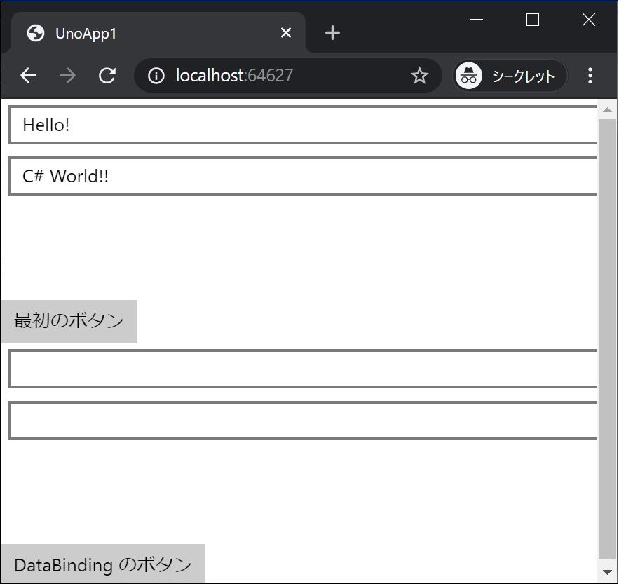
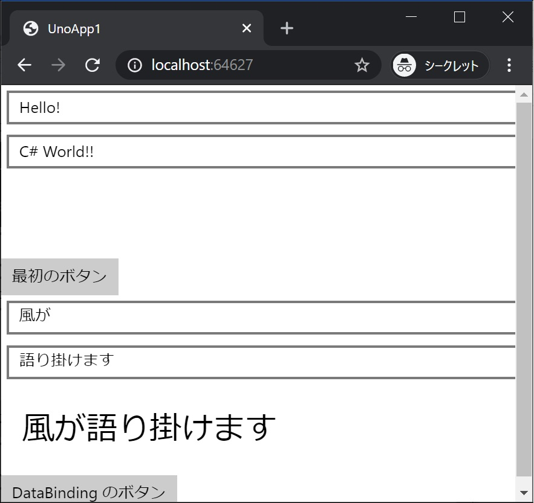

[Top](./top.md)  

# データバインディング

このページでは皆さん大好き、DataBinding をしていきます。

# Data を Binding する画面要素を追加

## Text 要素と Button 要素を追加

前ページでアプリに動きを付けた時と同じセットを、DataBinding 用に画面に追加します。

```xml

        <TextBox Text="{Binding Box1, Mode=TwoWay}" Margin="5" />
        <TextBox Text="{Binding Box2, Mode=TwoWay}" Margin="5" />
        <TextBlock Text="{Binding Block1, Mode=TwoWay}" Margin="20" FontSize="30" />
        <Button Command="{Binding Click}" Content="DataBinding のボタン"/>
```

**MainPage.xaml** 全体は次のようになります。

```xml
<Page
    x:Class="UnoApp1.MainPage"
    xmlns="http://schemas.microsoft.com/winfx/2006/xaml/presentation"
    xmlns:x="http://schemas.microsoft.com/winfx/2006/xaml"
    xmlns:local="using:UnoApp1"
    xmlns:d="http://schemas.microsoft.com/expression/blend/2008"
    xmlns:mc="http://schemas.openxmlformats.org/markup-compatibility/2006"
    mc:Ignorable="d">

  <Grid Background="{ThemeResource ApplicationPageBackgroundThemeBrush}">
    <ScrollViewer>
      <StackPanel>
        <TextBox x:Name="textBox1" Text="Hello! " Margin="5" />
        <TextBox x:Name="textBox2" Text="C# World!!" Margin="5" />
        <TextBlock x:Name="textBlock1" Margin="20" FontSize="30" />
        <Button Content="最初のボタン" Click="Button1_Click"/>

        <TextBox Text="{Binding Box1, Mode=TwoWay}" Margin="5" />
        <TextBox Text="{Binding Box2, Mode=TwoWay}" Margin="5" />
        <TextBlock Text="{Binding Block1, Mode=TwoWay}" Margin="20" FontSize="30" />
        <Button Command="{Binding Click}" Content="DataBinding のボタン"/>

      </StackPanel>

    </ScrollViewer>
  </Grid>
</Page>
```

## Command クラス、ViewModel クラスを追加

**<プロジェクト名>.Share** プロジェクトに **Command** クラス、**ViewModel** クラスを追加します。

#### Command クラス

```cs
using System;
using System.Windows.Input;

namespace UnoApp1.Shared
{
    class Command : ICommand
    {
        public event EventHandler CanExecuteChanged;
        public Action<object> Action { get; set; }

        public bool CanExecute(object parameter) => true;

        public void Execute(object parameter) => Action?.Invoke(parameter);
    }
}
```
#### ViewModel クラス
```cs
using System.ComponentModel;

namespace UnoApp1.Shared
{
    class MainPageViewModel : INotifyPropertyChanged
    {
        public event PropertyChangedEventHandler PropertyChanged;

        public string Box1 { get; set; }
        public string Box2 { get; set; }

        public string Block1 { get; set; }

        public Command Click { get; } = new Command();

        public MainPageViewModel() => Click.Action = OnClicked;

        void OnClicked(object parameter)
        {
            Block1 = $"{Box1}{Box2}";
            PropertyChanged?.Invoke(this, new PropertyChangedEventArgs(nameof(Block1)));
        }
    }
}
```

#### MainPage.xaml.cs の更新

次のコードを追加します。

```cs
            this.DataContext = new MainPageViewModel();
```

**MainPage.xaml.cs** 全体は次のようになります。

```cs
using Windows.UI.Xaml;
using Windows.UI.Xaml.Controls;
using UnoApp1.Shared;

namespace UnoApp1
{
    public sealed partial class MainPage : Page
    {
        public MainPage()
        {
            this.InitializeComponent();
            this.DataContext = new MainPageViewModel();
       }

        private void Button1_Click(object sender, RoutedEventArgs e)
        {
            textBlock1.Text = $"{textBox1.Text}{textBox2.Text}";
        }
    }
}
```

## 実行結果




見事！ DataBinding が動作しました！

[< | 前へ](./textbook3.md) | [次へ | >](./textbook5.md)
