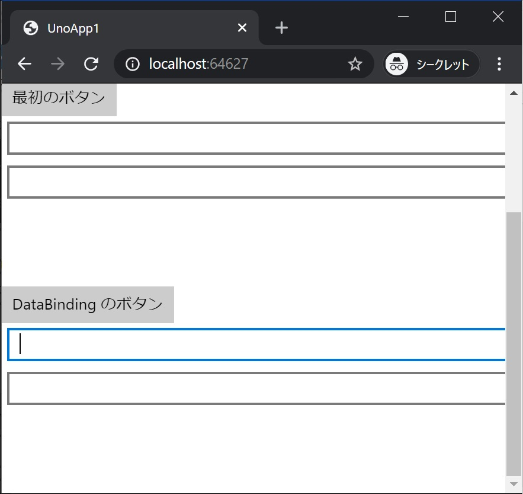
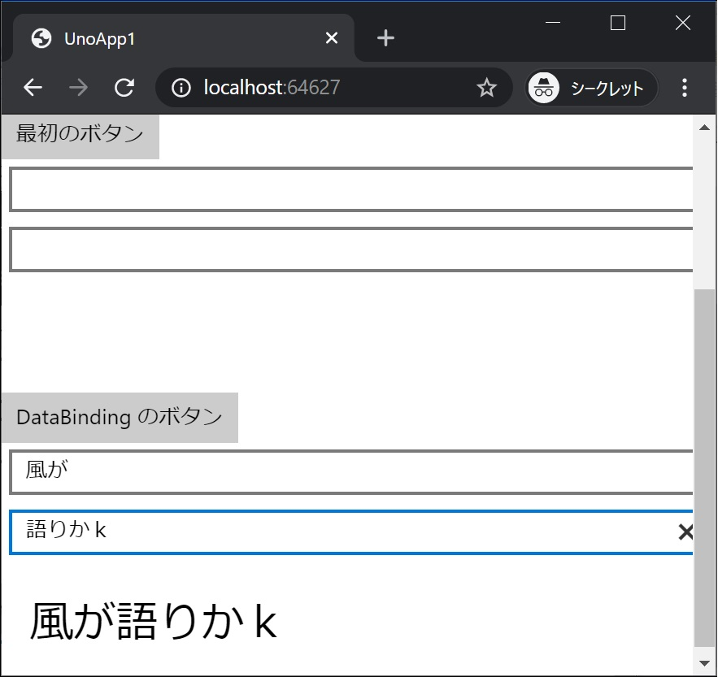

[Top](./top.md)  

# データバインディング その2

このページでは皆さん大好き、DataBinding をさらに使いこなして行きます。

# BindingBase クラスと UpdateSourceTrigger=PropertyChanged

ここまでシンプルな **DataBinding** をしてきましたが、皆さん実際には良く **BindingBase** クラスを作ったり、値の更新タイミングを ```UpdateSourceTrigger=PropertyChanged``` にしていたりしていると思います。  
**BindingBase** クラスと ```UpdateSourceTrigger=PropertyChanged``` でやってみます。

# Data を Binding する画面要素を追加

## Text 要素を追加

今回は、**Button** 要素は不要です。データバインディングをより使いこなすので。  

前回に動きを付けた時と同じセットを画面に追加します。

```xml
        <StackPanel x:Name="panel2">
          <TextBox Text="{Binding Box21, Mode=TwoWay, UpdateSourceTrigger=PropertyChanged}" Margin="5" />
          <TextBox Text="{Binding Box22, Mode=TwoWay, UpdateSourceTrigger=PropertyChanged}" Margin="5" />
          <TextBlock Text="{Binding Block21}" Margin="20" FontSize="30" />
        </StackPanel>
```

**MainPage.xaml** 全体は次のようになります。

```xml
<Page
    x:Class="UnoApp1.MainPage"
    xmlns="http://schemas.microsoft.com/winfx/2006/xaml/presentation"
    xmlns:x="http://schemas.microsoft.com/winfx/2006/xaml"
    xmlns:local="using:UnoApp1"
    xmlns:d="http://schemas.microsoft.com/expression/blend/2008"
    xmlns:mc="http://schemas.openxmlformats.org/markup-compatibility/2006"
    mc:Ignorable="d">

  <Grid Background="{ThemeResource ApplicationPageBackgroundThemeBrush}">
    <ScrollViewer>
      <StackPanel>
        <TextBox x:Name="textBox1" Text="Hello! " Margin="5" />
        <TextBox x:Name="textBox2" Text="C# World!!" Margin="5" />
        <TextBlock x:Name="textBlock1" Margin="20" FontSize="30" />
        <Button Content="最初のボタン" Click="Button1_Click"/>

        <TextBox Text="{Binding Box1, Mode=TwoWay}" Margin="5" />
        <TextBox Text="{Binding Box2, Mode=TwoWay}" Margin="5" />
        <TextBlock Text="{Binding Block1, Mode=TwoWay}" Margin="20" FontSize="30" />
        <Button Command="{Binding Click}" Content="DataBinding のボタン"/>

        <StackPanel x:Name="panel2">
          <TextBox Text="{Binding Box21, Mode=TwoWay, UpdateSourceTrigger=PropertyChanged}" Margin="5" />
          <TextBox Text="{Binding Box22, Mode=TwoWay, UpdateSourceTrigger=PropertyChanged}" Margin="5" />
          <TextBlock Text="{Binding Block21}" Margin="20" FontSize="30" />
        </StackPanel>

      </StackPanel>

    </ScrollViewer>
  </Grid>
</Page>
```

## BindingBase クラス、ViewModel クラスを追加

**BindingBase** クラス、**ViewModel** クラスを追加します。

#### BindingBase クラス

```cs
using System;
using System.ComponentModel;
using System.Runtime.CompilerServices;

namespace UnoApp1.Shared
{
    class BindingBase : INotifyPropertyChanged
    {
        public event PropertyChangedEventHandler PropertyChanged;

        protected bool SetProperty<T>(ref T property, T value, [CallerMemberName] string propertyName = null)
        {
            if (Object.Equals(property, value)) return false;
            property = value;
            PropertyChanged?.Invoke(this, new PropertyChangedEventArgs(propertyName));
            return true;
        }
    }
}
```

#### ViewModel クラス

```cs
namespace UnoApp1.Shared
{
    class MainPageViewModeBindingBase : BindingBase
    {
        string _box21;
        public string Box21 { get => _box21; set { if (SetProperty(ref _box21, value)) OnChanged(); } }
        string _box22;
        public string Box22 { get => _box22; set { if (SetProperty(ref _box22, value)) OnChanged(); } }

        string _block21;
        public string Block21 { get => _block21; set => SetProperty(ref _block21, value); }

        void OnChanged() => Block21 = $"{Box21}{Box22}";
    }
}
```

#### MainPage.xaml.cs の更新

次のコードを追加します。

```cs
            this.panel2.DataContext = new MainPageViewModeBindingBase();
```

**MainPage.xaml.cs** 全体は次のようになります。

```cs
using Windows.UI.Xaml;
using Windows.UI.Xaml.Controls;
using UnoApp1.Shared;

namespace UnoApp1
{
    public sealed partial class MainPage : Page
    {
        public MainPage()
        {
            this.InitializeComponent();
            this.DataContext = new MainPageViewModel();
            this.panel2.DataContext = new MainPageViewModeBindingBase();
       }

        private void Button1_Click(object sender, RoutedEventArgs e)
        {
            textBlock1.Text = $"{textBox1.Text}{textBox2.Text}";
        }
    }
}
```

## 実行結果




見事！ テキストを入力中にリアルタイムに Data が Binding しました！

[< | 前へ](./textbook4.md) | [次へ | >](./textbook6.md)
