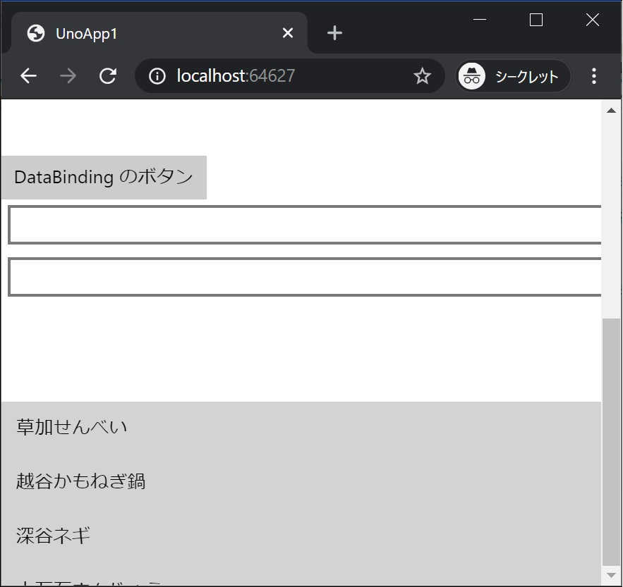
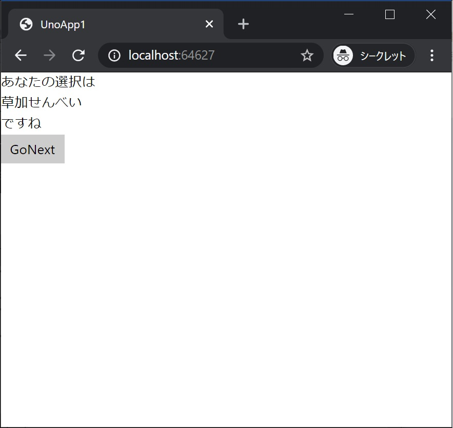

[Top](./top.md)  

# 画面遷移

一覧選択時に画面遷移するコードを書いていきます。

# 最初の画面に一覧選択イベントを追加

**MainPage.xaml** に **ListView** で要素クリック(タップ)時の処理を行えるイベントハンドラの設定を追加します。

```xml
ItemClick="listView_ItemClick" SelectionMode="None" IsItemClickEnabled="true"
```

イベントハンドラの設定を追加した **ListView** は次の様になります。

```xml
        <ListView x:Name="listView" Height="150" Background="LightGray"
                  ItemsSource="{Binding}" ItemClick="listView_ItemClick" SelectionMode="None" IsItemClickEnabled="true"/>
```

**MainPage.xaml** 全体は次のようになります。

```xml
<Page
    x:Class="UnoApp1.MainPage"
    xmlns="http://schemas.microsoft.com/winfx/2006/xaml/presentation"
    xmlns:x="http://schemas.microsoft.com/winfx/2006/xaml"
    xmlns:local="using:UnoApp1"
    xmlns:d="http://schemas.microsoft.com/expression/blend/2008"
    xmlns:mc="http://schemas.openxmlformats.org/markup-compatibility/2006"
    mc:Ignorable="d">

  <Grid Background="{ThemeResource ApplicationPageBackgroundThemeBrush}">
    <ScrollViewer>
      <StackPanel>
        <TextBox x:Name="textBox1" Text="Hello! " Margin="5" />
        <TextBox x:Name="textBox2" Text="C# World!!" Margin="5" />
        <TextBlock x:Name="textBlock1" Margin="20" FontSize="30" />
        <Button Content="最初のボタン" Click="Button1_Click"/>

        <TextBox Text="{Binding Box1, Mode=TwoWay}" Margin="5" />
        <TextBox Text="{Binding Box2, Mode=TwoWay}" Margin="5" />
        <TextBlock Text="{Binding Block1, Mode=TwoWay}" Margin="20" FontSize="30" />
        <Button Command="{Binding Click}" Content="DataBinding のボタン"/>

        <StackPanel x:Name="panel2">
          <TextBox Text="{Binding Box21, Mode=TwoWay, UpdateSourceTrigger=PropertyChanged}" Margin="5" />
          <TextBox Text="{Binding Box22, Mode=TwoWay, UpdateSourceTrigger=PropertyChanged}" Margin="5" />
          <TextBlock Text="{Binding Block21}" Margin="20" FontSize="30" />
        </StackPanel>

        <ListView x:Name="listView" Height="150" Background="LightGray"
          ItemsSource="{Binding}" ItemClick="listView_ItemClick" SelectionMode="None" IsItemClickEnabled="true"/>

      </StackPanel>

    </ScrollViewer>
  </Grid>
</Page>
```

# イベント処理で画面遷移のコードを追加

**MainPage.xaml.cs** に一覧で要素がクリック(タップ)された際に画面遷移するコードを追加します。  

```cs
        private void listView_ItemClick(object sender, ItemClickEventArgs e)
        {
            var value =  e.ClickedItem;

            this.Frame.Navigate(typeof(SecondPage), value);
        }
```

画面遷移をしているコードは ```this.Frame.Navigate(typeof(SecondPage), value);``` の部分です。

**MainPage.xaml.cs** 全体は次のようになります。

```cs
using Windows.UI.Xaml;
using Windows.UI.Xaml.Controls;
using UnoApp1.Shared;

namespace UnoApp1
{
    public sealed partial class MainPage : Page
    {
        public MainPage()
        {
            this.InitializeComponent();
            this.DataContext = new MainPageViewModel();
            this.panel2.DataContext = new MainPageViewModeBindingBase();
            listView.DataContext = new[] { "草加せんべい", "越谷かもねぎ鍋", "深谷ネギ", "十万石まんじゅう", "くらづくり最中" };
       }

        private void Button1_Click(object sender, RoutedEventArgs e)
        {
            textBlock1.Text = $"{textBox1.Text}{textBox2.Text}";
        }

        private void listView_ItemClick(object sender, ItemClickEventArgs e)
        {
            var value =  e.ClickedItem;

            this.Frame.Navigate(typeof(SecondPage), value);
        }
    }
}
```

## 実行結果



私は **草加せんべい** を選択！  
一覧で要素をクリック(タップ)すると、画面遷移し遷移先の画面にクリック(タップ)した値が表示されました！

[< | 前へ](./textbook7.md) | [次へ | >](./textbook9.md)
