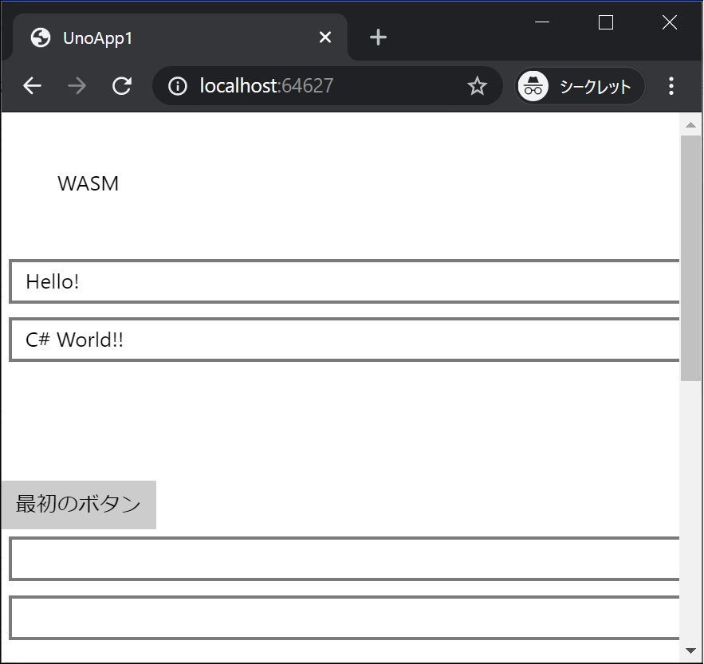
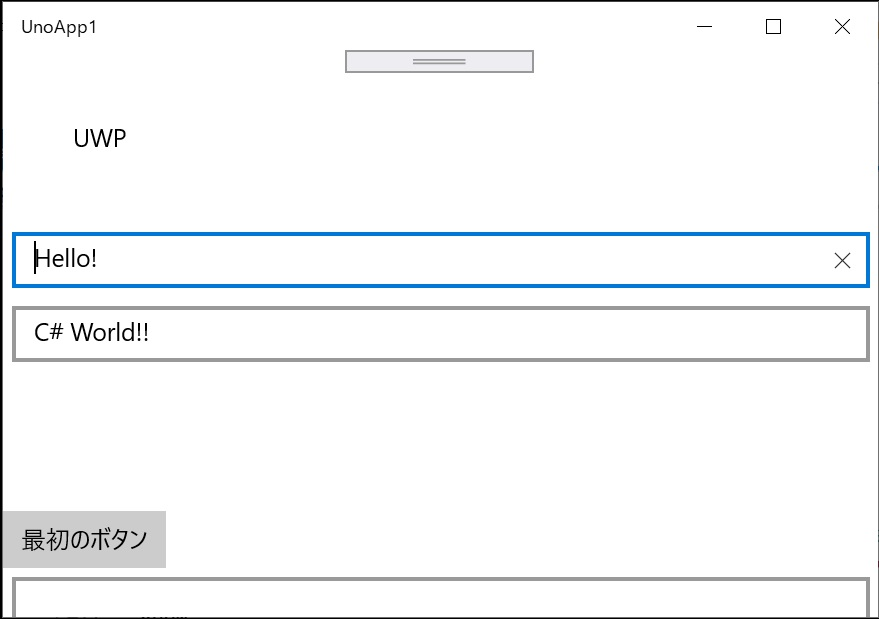
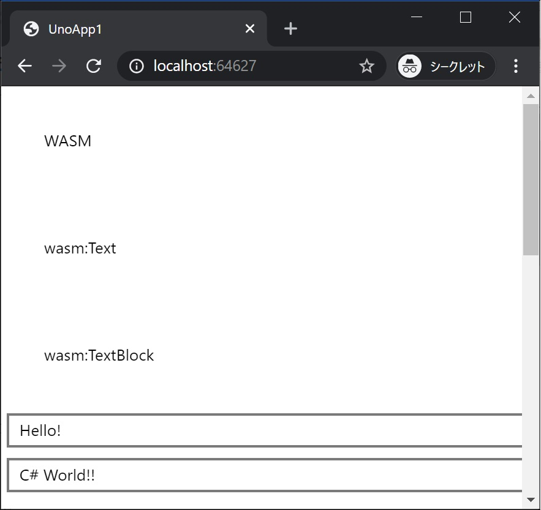
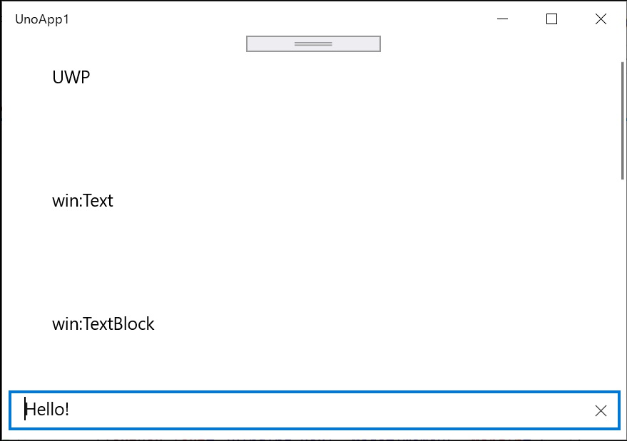

[Top](./top.md)  

# プラットフォーム毎の処理

ここが最後のページです。もうすこしで終わりです、頑張っていきましょう！  

このページではプラットフォーム毎にコードなどを変えてみます。  

# C# コードをプラットフォーム毎に変える (プリプロセッサディレクティブ)

```#if XXXXX``` から ```#endif``` で囲まれた範囲が **XXXXX** のプラットフォーム向けのコンパイル時にのみ有効になります。  

**参考**  
https://docs.microsoft.com/ja-jp/dotnet/csharp/language-reference/preprocessor-directives/preprocessor-if

```Cs
#if XXXXX

    // プラットフォーム固有の処理

#endif
```

**XXXXX** は Uno Platform のテンプレートでは次の様に設定されています。  

| プラットフォーム | 条件付きコンパイルシンボル |
|:-|:-|
| WebAssembly | \_\_WASM\_\_ |
| UWP | WINDOWS_UWP |
| Android | \_\_ANDROID\_\_ |
| iOS | \_\_IOS\_\_ |

**MainPage.xaml** にプラットフォーム毎に表示テキストを変える **TextBlock** を画面に追加します。

```xml
        <TextBlock x:Name="platform" Margin="40" />
```

今回は画面の一番上に表示されるように

```xml
  <Grid Background="{ThemeResource ApplicationPageBackgroundThemeBrush}">
    <ScrollViewer>
      <StackPanel>
  ```

のすぐ下に追加します。  
**MainPage.xaml** 全体は次のようになります。

```xml
<Page
    x:Class="UnoApp1.MainPage"
    xmlns="http://schemas.microsoft.com/winfx/2006/xaml/presentation"
    xmlns:x="http://schemas.microsoft.com/winfx/2006/xaml"
    xmlns:local="using:UnoApp1"
    xmlns:d="http://schemas.microsoft.com/expression/blend/2008"
    xmlns:mc="http://schemas.openxmlformats.org/markup-compatibility/2006"
    mc:Ignorable="d">

  <Grid Background="{ThemeResource ApplicationPageBackgroundThemeBrush}">
    <ScrollViewer>
      <StackPanel>
        <TextBlock x:Name="platform" Margin="40" />
        
        <TextBox x:Name="textBox1" Text="Hello! " Margin="5" />
        <TextBox x:Name="textBox2" Text="C# World!!" Margin="5" />
        <TextBlock x:Name="textBlock1" Margin="20" FontSize="30" />
        <Button Content="最初のボタン" Click="Button1_Click"/>

        <TextBox Text="{Binding Box1, Mode=TwoWay}" Margin="5" />
        <TextBox Text="{Binding Box2, Mode=TwoWay}" Margin="5" />
        <TextBlock Text="{Binding Block1, Mode=TwoWay}" Margin="20" FontSize="30" />
        <Button Command="{Binding Click}" Content="DataBinding のボタン"/>

        <StackPanel x:Name="panel2">
          <TextBox Text="{Binding Box21, Mode=TwoWay, UpdateSourceTrigger=PropertyChanged}" Margin="5" />
          <TextBox Text="{Binding Box22, Mode=TwoWay, UpdateSourceTrigger=PropertyChanged}" Margin="5" />
          <TextBlock Text="{Binding Block21}" Margin="20" FontSize="30" />
        </StackPanel>

        <ListView x:Name="listView" Height="150" Background="LightGray"
                  ItemsSource="{Binding}" SelectionChanged="listView_SelectionChanged" />

        </StackPanel>

    </ScrollViewer>
  </Grid>
</Page>
```

**MainPage.xaml.cs** にプラットフォーム毎に異なるテキストを設定するコードを追加します。
追加する場所はコンストラクタ ( ```public MainPage() { ...``` ) の最後です。

```cs
#if __WASM__
           platform.Text = "WASM";
#endif
#if WINDOWS_UWP
           platform.Text = "UWP";
#endif
#if __ANDROID__
           platform.Text = "Android";
#endif
#if __IOS__
           platform.Text = "iOS";
#endif
```

**MainPage.xaml.cs** 全体は次のようになります。

```cs
using Windows.UI.Xaml;
using Windows.UI.Xaml.Controls;
using UnoApp1.Shared;

namespace UnoApp1
{
    public sealed partial class MainPage : Page
    {
        public MainPage()
        {
            this.InitializeComponent();
            this.DataContext = new MainPageViewModel();
            this.panel2.DataContext = new MainPageViewModeBindingBase();
            listView.DataContext = new[] { "草加せんべい", "越谷かもねぎ鍋", "深谷ネギ", "十万石まんじゅう", "くらづくり最中" };
#if __WASM__
           platform.Text = "WASM";
#endif
#if WINDOWS_UWP
           platform.Text = "UWP";
#endif
#if __ANDROID__
           platform.Text = "Android";
#endif
#if __IOS__
           platform.Text = "iOS";
#endif
       }

        private void Button1_Click(object sender, RoutedEventArgs e)
        {
            textBlock1.Text = $"{textBox1.Text}{textBox2.Text}";
        }

        private void listView_SelectionChanged(object sender, SelectionChangedEventArgs e)
        {
            var view = sender as ListView;
            var index = view.SelectedIndex;
            if (index < 0) return;
            var value = (view.DataContext as string[])[index];

            this.Frame.Navigate(typeof(SecondPage), value);

            var data = listView.DataContext;
            listView.DataContext = null;
            listView.DataContext = data;
        }
    }
}
```

## 実行結果




プラットフォーム名が表示されました。画像は掲載していませんが、Android、iOS でも同様です。

# XAML のプロパティをプラットフォーム毎に変える

XAML の要素のプロパティをプラットフォーム毎に変えてみます。  
**MainPage.xaml** の先頭付近の Page 要素に次の属性を追加します。

```xml
    xmlns:wasm="http://uno.ui/wasm"
    xmlns:win="http://schemas.microsoft.com/winfx/2006/xaml/presentation"
    xmlns:android="http://uno.ui/android"
    xmlns:ios="http://uno.ui/ios"
```

続いて、**Page** 要素の **mc:Ignorable** の値に ```wasm android ios``` を追加します。

**参考**  
https://docs.microsoft.com/ja-jp/dotnet/framework/wpf/advanced/mc-ignorable-attribute

```xml
    mc:Ignorable="d wasm android ios"
```

さらに、プラットフォーム毎に異なる **Text** プロパティ値を設定する **TextBlock** を追加します。

```xml
        <TextBlock Margin="40" 
                   wasm:Text="wasm:Text"
                   win:Text="win:Text"
                   android:Text="android:Text"
                   ios:Text="ios:Text"
          />
```

追加する場所は

```xml
  <Grid Background="{ThemeResource ApplicationPageBackgroundThemeBrush}">
    <ScrollViewer>
      <StackPanel>
        <TextBlock x:Name="platform" Margin="40" />
```

の下です。
**MainPage.xaml** 全体は次のようになります。

```xml
<Page
    x:Class="UnoApp1.MainPage"
    xmlns="http://schemas.microsoft.com/winfx/2006/xaml/presentation"
    xmlns:x="http://schemas.microsoft.com/winfx/2006/xaml"
    xmlns:local="using:UnoApp1"
    xmlns:d="http://schemas.microsoft.com/expression/blend/2008"
    xmlns:mc="http://schemas.openxmlformats.org/markup-compatibility/2006"
    mc:Ignorable="d">

  <Grid Background="{ThemeResource ApplicationPageBackgroundThemeBrush}">
    <ScrollViewer>
      <StackPanel>
        <TextBlock x:Name="platform" Margin="40" />
        <TextBlock Margin="40" 
                   wasm:Text="wasm:Text"
                   win:Text="win:Text"
                   android:Text="android:Text"
                   ios:Text="ios:Text"
          />
        
        <TextBox x:Name="textBox1" Text="Hello! " Margin="5" />
        <TextBox x:Name="textBox2" Text="C# World!!" Margin="5" />
        <TextBlock x:Name="textBlock1" Margin="20" FontSize="30" />
        <Button Content="最初のボタン" Click="Button1_Click"/>

        <TextBox Text="{Binding Box1, Mode=TwoWay}" Margin="5" />
        <TextBox Text="{Binding Box2, Mode=TwoWay}" Margin="5" />
        <TextBlock Text="{Binding Block1, Mode=TwoWay}" Margin="20" FontSize="30" />
        <Button Command="{Binding Click}" Content="DataBinding のボタン"/>

        <StackPanel x:Name="panel2">
          <TextBox Text="{Binding Box21, Mode=TwoWay, UpdateSourceTrigger=PropertyChanged}" Margin="5" />
          <TextBox Text="{Binding Box22, Mode=TwoWay, UpdateSourceTrigger=PropertyChanged}" Margin="5" />
          <TextBlock Text="{Binding Block21}" Margin="20" FontSize="30" />
        </StackPanel>

        <ListView x:Name="listView" Height="150" Background="LightGray"
                  ItemsSource="{Binding}" SelectionChanged="listView_SelectionChanged" />

        </StackPanel>

    </ScrollViewer>
  </Grid>
</Page>
```

ここでは実行結果はまだ確認せず次の手順も行ってまとめて確認します。

# XAML の要素をプラットフォーム毎に変える
プロパティだけでなく、XAML の要素のレベルでプラットフォーム毎に変えてみます。  
**MainPage.xaml** の先頭付近の **Page** 要素に次の属性を追加します。

```xml
        <wasm:TextBlock Text="wasm:TextBlock" Margin="40"/>
        <win:TextBlock Text="win:TextBlock" Margin="40"/>
        <android:TextBlock Text="android:TextBlock" Margin="40" />
        <ios:TextBlock Text="ios:TextBlock" Margin="40" />
```

追加する場所は、先の手順で追加した **TextBlock** のすぐ下です。  
**MainPage.xaml** 全体は次のようになります。

```xml
<Page
    x:Class="UnoApp1.MainPage"
    xmlns="http://schemas.microsoft.com/winfx/2006/xaml/presentation"
    xmlns:x="http://schemas.microsoft.com/winfx/2006/xaml"
    xmlns:local="using:UnoApp1"
    xmlns:d="http://schemas.microsoft.com/expression/blend/2008"
    xmlns:mc="http://schemas.openxmlformats.org/markup-compatibility/2006"
    xmlns:wasm="http://uno.ui/wasm"
    xmlns:win="http://schemas.microsoft.com/winfx/2006/xaml/presentation"
    xmlns:android="http://uno.ui/android"
    xmlns:ios="http://uno.ui/ios"
    mc:Ignorable="d wasm android ios">

  <Grid Background="{ThemeResource ApplicationPageBackgroundThemeBrush}">
    <ScrollViewer>
      <StackPanel>
        <TextBlock x:Name="platform" Margin="40" />
        <TextBlock Margin="40" 
                   wasm:Text="wasm:Text"
                   win:Text="win:Text"
                   android:Text="android:Text"
                   ios:Text="ios:Text"
          />
        <wasm:TextBlock Text="wasm:TextBlock" Margin="40"/>
        <win:TextBlock Text="win:TextBlock" Margin="40"/>
        <android:TextBlock Text="android:TextBlock" Margin="40" />
        <ios:TextBlock Text="ios:TextBlock" Margin="40" />
        
        <TextBox x:Name="textBox1" Text="Hello! " Margin="5" />
        <TextBox x:Name="textBox2" Text="C# World!!" Margin="5" />
        <TextBlock x:Name="textBlock1" Margin="20" FontSize="30" />
        <Button Content="最初のボタン" Click="Button1_Click"/>

        <TextBox Text="{Binding Box1, Mode=TwoWay}" Margin="5" />
        <TextBox Text="{Binding Box2, Mode=TwoWay}" Margin="5" />
        <TextBlock Text="{Binding Block1, Mode=TwoWay}" Margin="20" FontSize="30" />
        <Button Command="{Binding Click}" Content="DataBinding のボタン"/>

        <StackPanel x:Name="panel2">
          <TextBox Text="{Binding Box21, Mode=TwoWay, UpdateSourceTrigger=PropertyChanged}" Margin="5" />
          <TextBox Text="{Binding Box22, Mode=TwoWay, UpdateSourceTrigger=PropertyChanged}" Margin="5" />
          <TextBlock Text="{Binding Block21}" Margin="20" FontSize="30" />
        </StackPanel>

        <ListView x:Name="listView" Height="150" Background="LightGray"
                  ItemsSource="{Binding}" SelectionChanged="listView_SelectionChanged" />

        </StackPanel>

    </ScrollViewer>
  </Grid>
</Page>
```

## 実行結果




**計画通り！** プラットフォーム毎に異なる表示がされました。画像は掲載していませんが、Android、iOS でも同様です。

# 良い Uno Platform ライフを！

今回の Hello world はこれで終わりです。基本は押さえられたと思います。是非 Uno Platform でのアプリ開発にチャレンジしてみてください。  
おつかれさまでした。

[< | 前へ](./textbook8.md) | [Topへ | >](./top.md)
